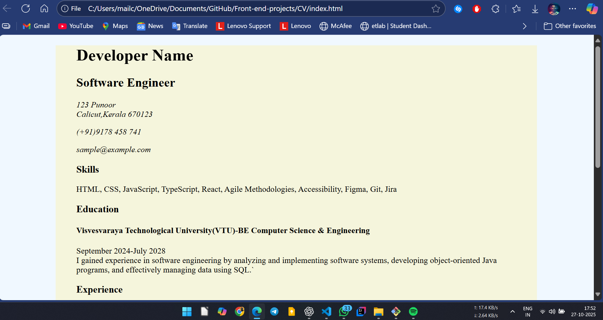
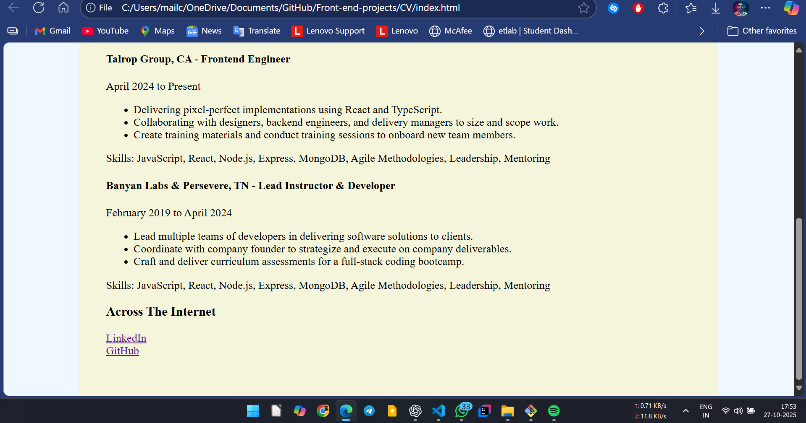

# Personal CV - Frontend Project

This is a simple **single-page CV** built using **HTML and CSS**.  
It demonstrates clean structure, semantic elements, and basic styling for a personal resume/portfolio page.

---

## 📂 Files
- `index.html` → The main CV page containing personal details, skills, education, and experience.  
- `style.css` → Provides basic styling such as layout, colors, and typography.  

---

### Screenshots



---



---

## 🚀 How to View
1. Clone this repository:
   ```bash
   https://github.com/zainkp/cv-project